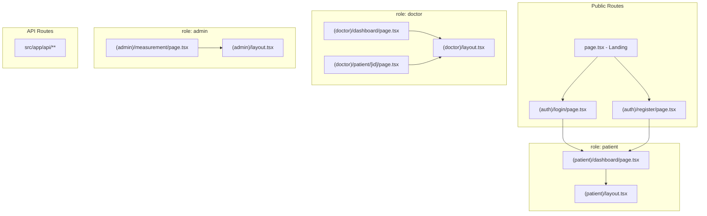

# Project Reorganization Plan: Route Groups

## Current State Analysis

### Issues Identified
1. **Incorrect imports**: [`src/app/page.tsx`](src/app/page.tsx:4) imports from `src/components/patient/` which doesn't exist
2. **Mixed concerns**: Admin and patient routes are not properly separated
3. **No route protection**: No role-based access control layouts
4. **Component duplication**: Components exist in both root and `admin/` folders

### Current Structure
```
src/app/
├── page.tsx                    # Patient dashboard (should be protected)
├── layout.tsx
├── globals.css
├── admin/                      # Admin section
│   ├── page.tsx
│   ├── layout.tsx
│   ├── components/
│   ├── dashboard/
│   └── measurement/
└── api/                        # API routes
```

---

## Proposed New Structure

```
src/app/
├── (auth)/                     # Route Group: Authentication (public)
│   ├── login/
│   │   └── page.tsx
│   └── register/
│       └── page.tsx
│
├── (patient)/                  # Route Group: Patient (protected)
│   ├── layout.tsx             # Layout with patient role verification
│   └── dashboard/
│       └── page.tsx           # Patient dashboard (from current page.tsx)
│
├── (doctor)/                  # Route Group: Doctor (protected)
│   ├── layout.tsx             # Layout with doctor role verification
│   ├── dashboard/
│   │   └── page.tsx          # Doctor's patient list
│   └── patient/
│       └── [id]/
│           └── page.tsx       # Doctor's patient detail view
│
├── api/                       # API routes (unchanged)
│   └── ...
│
└── page.tsx                   # Public landing page (NEW)
```

---

## Benefits of Route Groups

1. **Layout isolation**: Each group can have its own layout without affecting others
2. **Role-based protection**: Layouts can verify user roles before rendering
3. **URL cleanliness**: Route groups don't affect the URL path
4. **Code organization**: Clear separation of concerns by user role

---

## Migration Steps

### Step 1: Create Route Group Directories
```bash
mkdir -p src/app/\(auth\)/login
mkdir -p src/app/\(auth\)/register
mkdir -p src/app/\(patient\)/dashboard
mkdir -p src/app/\(doctor\)/dashboard
mkdir -p src/app/\(doctor\)/patient/\[id\]
```

### Step 2: Create Protected Layouts

#### `(patient)/layout.tsx`
```tsx
import { redirect } from 'next/navigation';

export default function PatientLayout({ children }) {
  // TODO: Implement real auth check
  const session = await getSession();
  
  if (!session || session.user.role !== 'patient') {
    redirect('/login');
  }

  return (
    <div className="min-h-screen bg-slate-950">
      <PatientSidebar />
      <main>{children}</main>
    </div>
  );
}
```

#### `(doctor)/layout.tsx`
```tsx
import { redirect } from 'next/navigation';

export default function DoctorLayout({ children }) {
  // TODO: Implement real auth check
  const session = await getSession();
  
  if (!session || session.user.role !== 'doctor') {
    redirect('/login');
  }

  return (
    <div className="min-h-screen bg-slate-950">
      <DoctorSidebar />
      <main>{children}</main>
    </div>
  );
}
```

### Step 3: Create Pages

#### `(patient)/dashboard/page.tsx`
- Move current `page.tsx` content here
- Fix imports to use `src/components/` instead of `src/components/patient/`

#### `(doctor)/dashboard/page.tsx`
- Create new doctor dashboard showing patient list
- Include patient stats, recent activity

#### `(doctor)/patient/[id]/page.tsx`
- Move admin page content here
- Include DoctorNotes component

#### `(auth)/login/page.tsx` & `(auth)/register/page.tsx`
- Create new auth pages

#### `page.tsx` (root)
- Convert to public landing page

### Step 4: Fix Component Imports

Current problematic imports in `page.tsx`:
```tsx
// WRONG - path doesn't exist
import { MetricCard } from "@/components/patient/MetricCard";
import { PatientHeader } from "@/components/patient/PatientHeader";
import { CompositionTable } from "@/components/patient/CompositionTable";
import { AdvancedMetrics } from "@/components/patient/AdvancedMetrics";
import { EmptyState } from "@/components/patient/EmptyState";
```

Fix to:
```tsx
// CORRECT - use root components
import { MetricCard } from "@/components/MetricCard";
import { PatientHeader } from "@/components/admin/PatientHeader";
// etc.
```

### Step 5: Handle Admin Routes

Options:
1. **Move to (doctor) group**: `src/app/(doctor)/admin/...`
2. **Keep separate**: Add admin route group `(admin)/`

Recommended: Add `(admin)` route group for full admin functionality:
```
├── (admin)/                   # Route Group: Admin (superuser)
│   ├── layout.tsx
│   ├── measurement/
│   │   └── page.tsx
│   └── ...other admin pages
```

---

## File Changes Summary

| Action | Source | Destination |
|--------|--------|-------------|
| Move | `src/app/page.tsx` | `src/app/(patient)/dashboard/page.tsx` |
| Move | `src/app/admin/page.tsx` | `src/app/(doctor)/dashboard/page.tsx` |
| Move | `src/app/admin/measurement/page.tsx` | `src/app/(admin)/measurement/page.tsx` |
| Create | - | `src/app/(patient)/layout.tsx` |
| Create | - | `src/app/(doctor)/layout.tsx` |
| Create | - | `src/app/(auth)/login/page.tsx` |
| Create | - | `src/app/(auth)/register/page.tsx` |
| Create | - | `src/app/(doctor)/patient/[id]/page.tsx` |
| Convert | `src/app/page.tsx` | Public landing page |

---

## Next Steps

1. Review and approve this plan
2. Switch to Code mode to implement changes
3. Test all routes after migration
4. Verify authentication flows

---

## Mermaid: New Architecture


